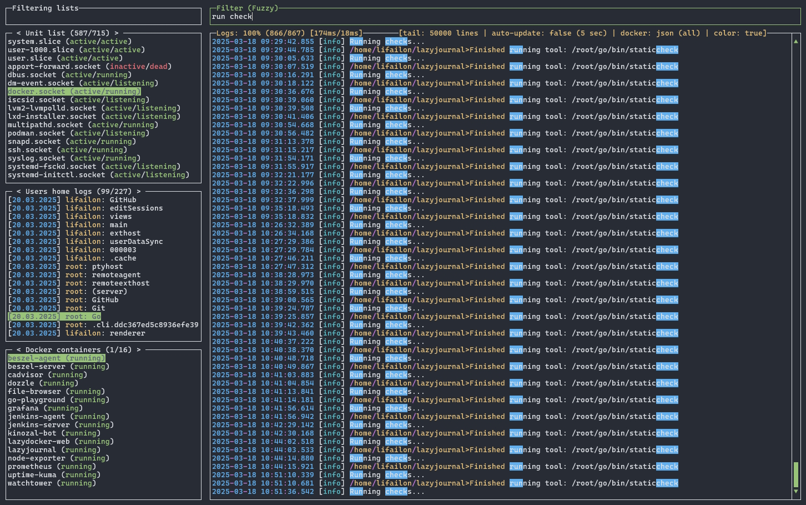
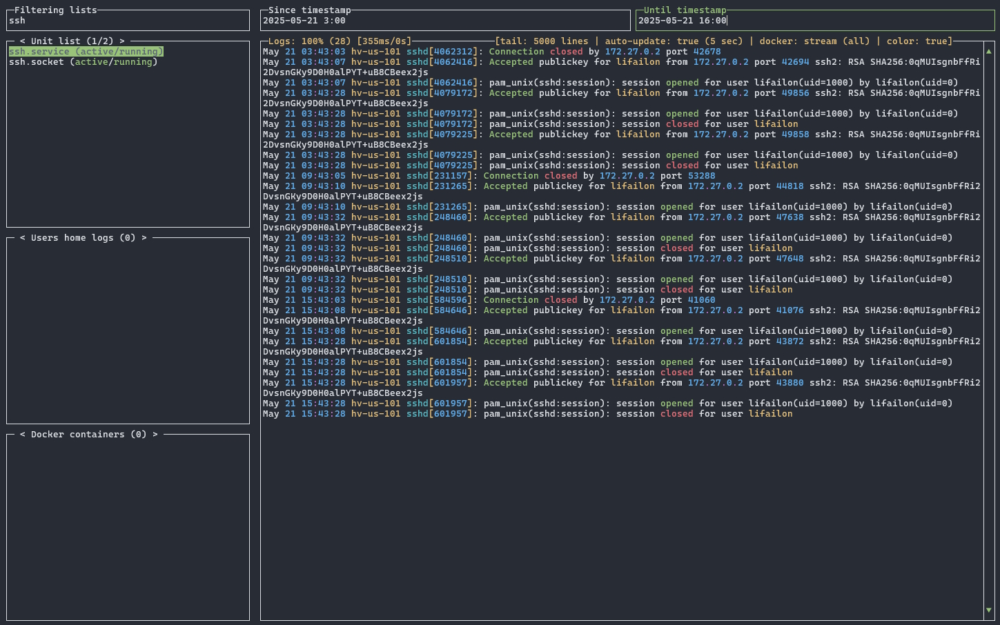
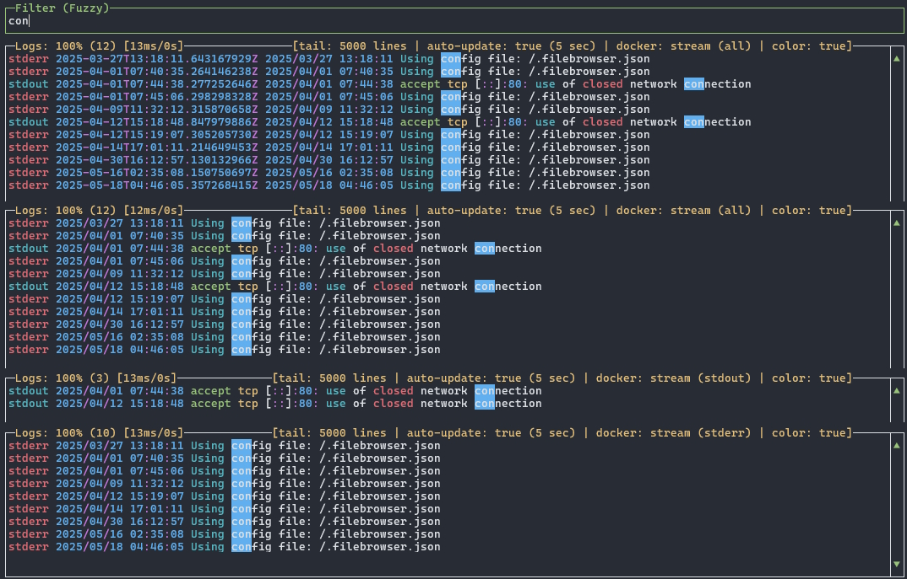
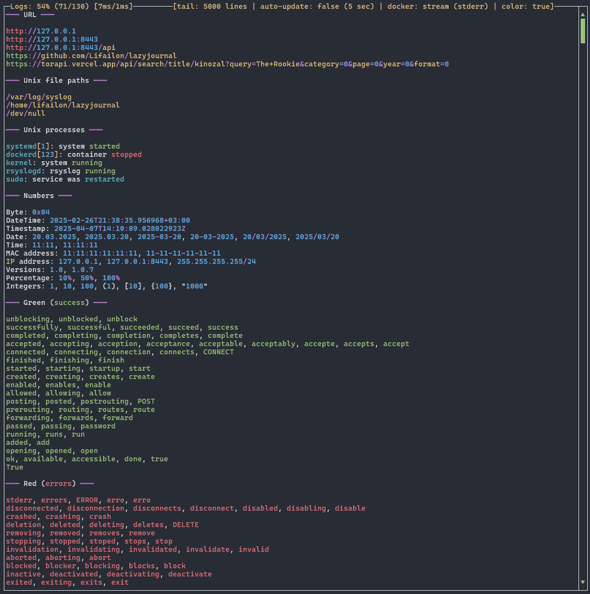

<p align="center">
    
</p>

<p align="center">
    <a href="https://github.com/Lifailon/lazyjournal/actions/workflows/build.yml"></a>
    <a href="https://raw.githubusercontent.com/wiki/Lifailon/lazyjournal/coverage.html"></a>
    <a href="https://goreportcard.com/report/github.com/Lifailon/lazyjournal"></a>
    <a href="https://pkg.go.dev/github.com/Lifailon/lazyjournal"></a>
    <a href="https://github.com/Lifailon/lazyjournal/blob/rsa/LICENSE"></a>
    <a href="https://github.com/avelino/awesome-go?tab=readme-ov-file#logging"></a>
<br>
    <a href="https://aur.archlinux.org/packages/lazyjournal"></a>
    <a href="https://anaconda.org/conda-forge/lazyjournal"></a>
    <a href="https://formulae.brew.sh/formula/lazyjournal"></a>
    <a href="https://hub.docker.com/r/lifailon/lazyjournal"></a>
</p>

Terminal user interface for reading logs from `journald`, `auditd`, file system, Docker (including Swarm) containers, Podman and Kubernetes pods with support for output coloring and multiple filtering modes. Written in Go with the [awesome-gocui](https://github.com/awesome-gocui/gocui) (fork [gocui](https://github.com/jroimartin/gocui)) library.

This tool is inspired by and with love for [LazyDocker](https://github.com/jesseduffield/lazydocker) and [LazyGit](https://github.com/jesseduffield/lazygit). It is also included in [Awesome-Go](https://github.com/avelino/awesome-go?tab=readme-ov-file#logging), [Awesome-TUIs](https://github.com/rothgar/awesome-tuis?tab=readme-ov-file#development) and [Awesome-Docker](https://github.com/veggiemonk/awesome-docker?tab=readme-ov-file#terminal-ui), check out other useful projects on the repository pages.


<details>
    <summary>Screenshots</summary>
    <li>Filtering the file log using fuzzy search:</li>
    
    <li>Filtering by timestamp for ssh log from systemd:</li>
    
    <li>Disabling built-in timestamp in docker logs and filtering by stream:</li>
    
    <li>Demo file of built-in output coloring for the log:</li>
    
</details>

## Features

- Simple installation, to run download one executable file without dependencies and settings.
- Centralized search for the required journal by filtering all lists (log sources).
- Streaming output of new events from the selected journal (like `tail`).
- List of all units (`services`, `sockets`, etc.) with current running status from `systemd` to access their logs.
- View all system and user journals via `journalctl` (tool for reading logs from [journald](https://github.com/systemd/systemd/tree/main/src/journal)).
- List of all system boots for kernel log output.
- List of audit rules from `auditd` for filtering by keys and viewing in `interpret` format.
- File system logs such as for `Apache` or `Nginx`, as well as `syslog`, `messages`, etc. from `/var/log`.
- Lists all log files in users home directories, as well as descriptor log files used by processes.
- Reading archive logs truncated during rotation (`gz`, `xz` and `bz2` formats) and Packet Capture (`pcap` format).
- Apple System Logs support (`asl` format).
- Search and analyze all logs from remote hosts in one interface using [rsyslog](https://www.rsyslog.com) configuration.
- Docker and Swarm logs from the file system or stream, including build-in timestamps and filtering by stream.
- Podman logs, without the need to run a background process (socket).
- Kubernetes pods (you must first configure a connection to the cluster via `kubectl`).
- Windows Event Logs via `PowerShell` and `wevtutil`, as well as application logs from Windows file system.

### Filtering

Supports 4 filtering modes:

- **Default** - case sensitive exact search.
- **Fuzzy** (like `fzf`) - custom inexact case-insensitive search (searches for all phrases separated by a space anywhere on a line).
- **Regex** (like `grep`) - search with regular expression support, based on the built-in [regexp](https://pkg.go.dev/regexp) library, case-insensitive by default (in case a regular expression syntax error occurs, the input field will be highlighted in red).
- **Timestamp** - filter `since` and/or `until` by date and time for `journald` and docker or podman logs in stream mode. This mode affects the loading of the log (thereby increasing performance) and can be used in conjunction with other filtering modes, so the current log should be reloaded by pressing `Enter` in the current input field.

Supported formats for timestamp:

- `00:00`
- `00:00:00`
- `2025-04-14`
- `2025-04-14 00:00`
- `2025-04-14 00:00:00`

### Coloring

Supported coloring groups for output:

- **Custom** - URLs, file paths and processes in UNIX.
- **Yellow** - known names (host name and system users) and warnings.
- **Green** - keywords indicating success.
- **Red** - keywords indicating error.
- **Blue** - statuses (info, debug, etc), actions (install, update, etc) and HTTP methods (GET, POST, etc).
- **Light blue** - numbers (date, time, timestamp, bytes, versions, percentage, integers, IP and MAC addresses).

A full list of all keywords can be found in the [color.log](/color.log) file (used for testing only). If you have suggestions for improving coloring (e.g. adding new words), you can open an [issue](https://github.com/Lifailon/lazyjournal/issues) for a new feature. 

Coloring directly affects the loading time of the log, to increase the performance of reading large logs, it is possible to disable coloring using the `Ctrl+Q`.

## Install

Binaries are available for download on the [releases](https://github.com/Lifailon/lazyjournal/releases) page.

List of supported systems and architectures in which functionality is checked: 

| OS        | amd64 | arm64 | Systems                                                                                                                               |
| -         | -     | -     | -                                                                                                                                     |
| Linux     | ✔     |  ✔   | Raspberry Pi (`aarch64`), Oracle Linux (RHEL-based in WSL environment), Arch Linux, Rocky Linux, Ubuntu Server 20.04.6 and above.    |
| Darwin    | ✔     |  ✔   | macOS Sequoia 15.2 `x64` on MacBook and the `arm64` in GitHub Actions.                                                               |
| BSD       | ✔     |       | OpenBSD 7.6 and FreeBSD 14.2.                                                                                                        |
| Windows   | ✔     |       | Windows 10 and 11.                                                                                                                   |

### Unix-based

Run the command in the console to quickly install or update the stable version for Linux, macOS or the BSD-based system:

```shell
curl -sS https://raw.githubusercontent.com/Lifailon/lazyjournal/main/install.sh | bash
```

> [!NOTE]
> This command will run a script that downloads the latest version of the executable binary from the GitHub repository to the home directory along with other executable files for the current user (default path `~/.local/bin/`) and grants permission to execute it.

### Debian-based

If you are using Ubuntu or any other Debian-based system, you can also download the `deb` package to manage installation and removal:

```bash
arch=$( [ "$(uname -m)" = "aarch64" ] && echo "arm64" || echo "amd64" )
version=$(curl -L -sS -H 'Accept: application/json' https://github.com/Lifailon/lazyjournal/releases/latest | sed -e 's/.*"tag_name":"\([^"]*\)".*/\1/')
curl -L -sS https://github.com/Lifailon/lazyjournal/releases/download/$version/lazyjournal-$version-$arch.deb -o /tmp/lazyjournal.deb
sudo apt install /tmp/lazyjournal.deb # or sudo dpkg -i /tmp/lazyjournal.deb
```

### Eget

You can use the universal way to install the latest version binaries from the GitHub repository using [eget](https://github.com/zyedidia/eget):

```shell
eget lifailon/lazyjournal --to ~/.local/bin
```

### Arch Linux

If you an Arch Linux user you can also install from the [AUR](https://aur.archlinux.org/packages/lazyjournal):

```shell
paru -S lazyjournal
```

### Conda / mamba / pixi (Linux / macOS / Windows)

If you use package managers like conda or mamba, you can install `lazyjournal` from [conda-forge](https://anaconda.org/conda-forge/lazyjournal):

```shell
conda install -c conda-forge lazyjournal
mamba install -c conda-forge lazyjournal
```

You can install `lazyjournal` user-globally using [pixi](https://prefix.dev):

```shell
pixi global install lazyjournal
```

### Homebrew (macOS / Linux)

Use the following command to install `lazyjournal` using [Homebrew](https://formulae.brew.sh/formula/lazyjournal):

```shell
brew install lazyjournal
```

### Docker (Debian-based)

To run the interface in a container, download [docker-compose](/docker-compose.yml) and use the image from [Docker Hub](https://hub.docker.com/r/lifailon/lazyjournal):

```shell
mkdir lazyjournal && cd lazyjournal
curl -sS https://raw.githubusercontent.com/Lifailon/lazyjournal/main/docker-compose.yml -o docker-compose.yml
curl -sS https://raw.githubusercontent.com/Lifailon/lazyjournal/main/.env -o .env
docker-compose up -d
docker exec -it lazyjournal lazyjournal
```

The image is based on Debian with `systemd` and docker cli pre-installed. The necessary **read-only** permissions are already preset in `docker-compose` to support all log sources from the host system (review it to customize for your individual use).

### Web mode

Supports running in the Web interface via [ttyd](https://github.com/tsl0922/ttyd). To do this, edit the variables in the `.env` file:

```shell
TTYD=true
PORT=5555
# Credentials for accessing the Web interface (optional)
USERNAME=admin
PASSWORD=admin
```

### Windows

Use the following command to quickly install in your PowerShell console:

```PowerShell
irm https://raw.githubusercontent.com/Lifailon/lazyjournal/main/install.ps1 | iex
```

The following directories are used to search for logs in the file system:

- `Program Files`
- `Program Files (x86)`
- `ProgramData`
- `AppData\Local` and `AppData\Roamin` for current user

To read logs, automatic detection of the following encodings is supported:

- `UTF-8`
- `UTF-16 with BOM`
- `UTF-16 without BOM`
- `Windows-1251` by default

### Go package

You can also use Go to install ([Go](https://go.dev/doc/install) must be installed on the system):

```shell
go install github.com/Lifailon/lazyjournal@latest
```

## Usage

You can run the interface from anywhere:

```
lazyjournal                            Run interface
lazyjournal --help, -h                 Show help
lazyjournal --version, -v              Show version
lazyjournal --audit, -a                Show audit information
lazyjournal --tail, -t                 Change the number of log lines to output (default: 50000, range: 200-200000)
lazyjournal --update, -u               Change the auto refresh interval of the log output (default: 5, range: 2-10)
lazyjournal --disable-autoupdate, -e   Disable streaming of new events (log is loaded once without automatic update)
lazyjournal --disable-color, -d        Disable output coloring
lazyjournal --disable-mouse, -m        Disable mouse control support
lazyjournal --disable-timestamp, -s    Disable timestamp for docker logs
lazyjournal --only-stream, -o          Force reading of docker container logs in stream mode (by default from the file system)
lazyjournal --command-color, -c        ANSI coloring in command line mode
lazyjournal --command-fuzzy, -f        Filtering using fuzzy search in command line mode
lazyjournal --command-regex, -r        Filtering using regular expression (regexp) in command line mode
```

Access to all system logs and containers may require elevated privileges for the current user. For example, if a user does not have read permission to the directory `/var/lib/docker/containers`, he will not be able to access all archived logs from the moment the container is started, but only from the moment the containerization system is started, so the process of reading logs is different. However, reading in streaming mode is faster than parsing json logs from the file system.

Information in the subtitle of the `Logs` window:

- `tail` - maximum number of log lines to output (affects log loading performance).
- `auto-update (interval)` - current mode of operation for automatic display of new events (disabled by manually scrolling the log output or using the `Ctrl+U` keyboard shortcut) and update interval (file logs are updated only when there are changes).
- `docker` - displays the current mode for loading the container log (stream mode from the docker api or in json format from the file system) and stream display mode (all, stdout or stderr only).
- `color` - displays the status (enabled or disabled) of the output coloring for the log.

### Command-line mode

Coloring and filtering of output is supported in command-line mode:

```shell
alias lj=lazyjournal # >> $HOME/.bashrc

# Coloring the output from stdin
cat /var/log/syslog | lj -c

# Filtering output in fuzzy search and regular expression mode
cat /var/log/syslog | lj -f "error"
cat /var/log/syslog | lj -r "failed|fatal|crash"
```

### Control

Mouse control is supported for window selection, history, list scrolling and history. To copy text, use `Alt+Shift` when selecting.

List of all used keyboard shortcuts:

- `F1` or `?` - show help on hotkeys.
- `Tab` - switch to next window.
- `Shift+Tab` - return to previous window.
- `/` - go to the filter window from the current list window or logs window.
- `Esc` - clear text in the current filter window or close help.
- `Enter` - load a log from the list window or return to the previous window from the filter window.
- `<Left/h>` and `<Right/l>` - switch between journal lists in the selected window.
- `<Up/PgUp/k>` and `<Down/PgDown/j>` - move up and down through all journal lists and log output, as well as changing the filtering mode in the filter window.
- `<Shift/Alt>+<Up/Down>` - quickly move up and down through all journal lists and log output every `10` or `100` lines (`500` for log output).
- `<Shift/Alt/Ctrl>+<k/j>` - quickly move up and down (like Vim and alternative for macOS).
- `Ctrl+A` or `Home` - go to the top of the log.
- `Ctrl+E` or `End` - go to the end of the log.
- `Alt+Left/Right` - change the number of log lines to output (default: `50000`, range: `200-200000`).
- `Shift+Left/Right` - change the auto refresh interval of the log output (default: `5`, range: `2-10`).
- `Ctrl+D` - change read mode for docker logs (streams only or json from file system).
- `Ctrl+S` - change streams display mode for docker logs (all, stdout or stderr only).
- `Ctrl+T` - enable or disable built-in timestamp and stream type for docker logs.
- `Ctrl+W` - enable or disable ANSI coloring for output.
- `Ctrl+N` - enable or disable coloring via [tailspin](https://github.com/bensadeh/tailspin).
- `Ctrl+U` - disable streaming of new events (log is loaded once without automatic update).
- `Ctrl+Q` - update the current log output manually.
- `Ctrl+R` - update all log lists.
- `Ctrl+C` - exit.

## Build

Clone the repository and run the project:

```shell
git clone https://github.com/Lifailon/lazyjournal
cd lazyjournal
go run main.go
```

> [!IMPORTANT]
> The master branch is used for development, so it may not be stable when running from source, and is intended for testing new features before release.

Use `make` to build the binary for the current system and platform:

```shell
make build
```

## Testing

Unit tests cover all main functions and interface operation.

```shell
# Get a list of all tests
make list
# Run selected or all tests
make test n=TestMockInterface
make test-all
```

> [!NOTE]
> The test coverage report using CI Actions for Linux, macOS and Windows systems is available on the [Wiki](https://github.com/Lifailon/lazyjournal/wiki) page. Testing on BSD-based systems is done in a home environment.

Check the source code on the base linters using [golangci-lint](https://github.com/golangci/golangci-lint) (including all [critic](https://github.com/go-critic/go-critic) and severity high in [security](https://github.com/securego/gosec)):

```shell
make lint
```

## Contributing

Since this is my first Go project, there may be some bad practices, BUT I want to make `lazyjournal` better. Any contribution will be appreciated! If you want to implement any new feature or fix something, please [open an issue](https://github.com/Lifailon/lazyjournal/issues) first.

Thanks to all participants for their contributions:

- [Matteo Giordano](https://github.com/malteo) for upload and update the package in `AUR`.
- [Ueno M.](https://github.com/eunos-1128) for upload and update the package in `Homebrew` and `Conda`.

You can also upload the package yourself to any package manager you use and make [Pull Requests](https://github.com/Lifailon/lazyjournal/pulls).

## Alternatives

- [Lnav](https://github.com/tstack/lnav) - The Logfile Navigator is a log file viewer for the terminal.
- [TooLong](https://github.com/Textualize/toolong) - A terminal application to view, tail, merge, and search log files.
- [Dozzle](https://github.com/amir20/dozzle) - A small lightweight application with a web based interface to monitor Docker logs.

## License

This project is licensed under the **MIT License**. See the [LICENSE](LICENSE) file for details.

Copyright (C) 2024 Lifailon (Alex Kup)
